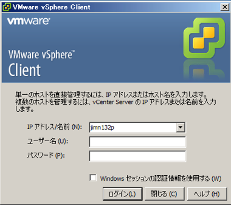
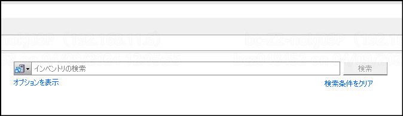
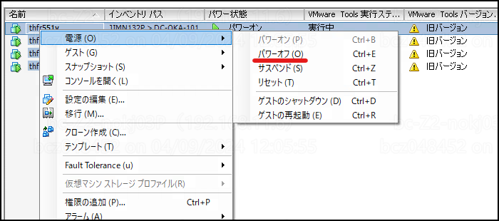

# th_OS停止手順書.md

-----------------------------------------------------------------------------------
## 作業要件
-----------------------------------------------------------------------------------
|#|項目|内容|
|:--|:--|:--|
|1|対象システム|Hybrid講座システム_問題配信システム|
|2|対象ホスト|thap501v,thap502v,thbt501v,thdb501v,thdb502v,thfr551v,thap511v,thdb511v,thfr561v,thap521v,thbt521v,thdb521v,thdb522v,thfr571v,thap541v,thbt541v,thdb541v,thfr591v|
|3|作業予定日|2024/04/11|

-----------------------------------------------------------------------------------
## 1. 事前作業
-----------------------------------------------------------------------------------
1. 作業開始連絡 
   関係者に作業開始の連絡を行う

-----------------------------------------------------------------------------------
## 2. vSphereクライアントへログイン
-----------------------------------------------------------------------------------
1. VMware vSphere Clientを起動してログインする 
   

-----------------------------------------------------------------------------------
## 3. OS停止
-----------------------------------------------------------------------------------
1. 対象ホスト選択 
   インベントリの選択より対象ホストを検索する 
   - 検索文字列 
      1回目："thfr5" 
      2回目："thap5" 
      3回目："thbt5" 
      4回目："thdb5" 
   
   
1. OS停止 
   右クリックより[電源]>[パワーオフ]を選択し停止する 
   

2. 停止確認 
   対象サーバの状態が「パワーオフ」であることを確認する 

-----------------------------------------------------------------------------------
## 99. 事後作業
-----------------------------------------------------------------------------------
1. ログアウト 
   VMware vSphere Clientのウインドウを閉じる
   
2. 完了連絡及び動作確認依頼 
   関係者に作業完了の連絡と、動作確認依頼を行う。
