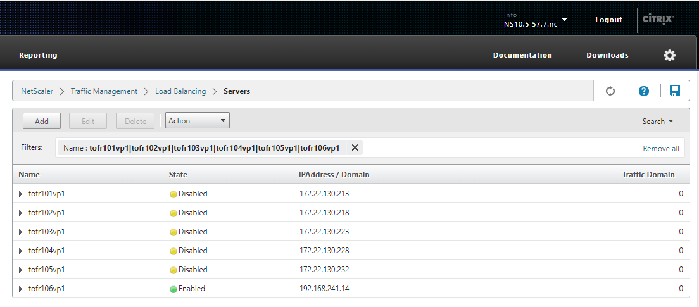
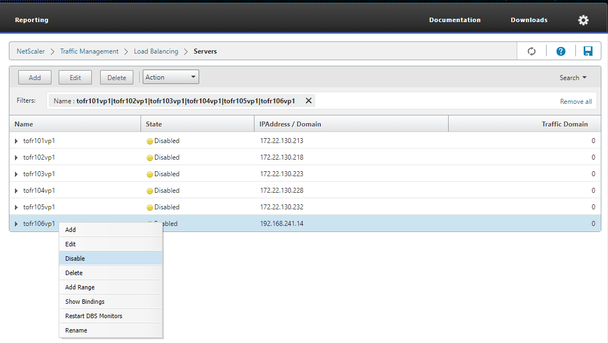

# 【Hybrid講座システム_本番】s01環境撤去手順書

-----------------------------------------------------------------------------------
## 作業要件
-----------------------------------------------------------------------------------
|#|項目|内容|
|:--|:--|:--|
|1|対象システム|Hybrid講座システム 中ゼミ特別教材システム|
|2|対象ホスト|tofr101v,tofr102v,tofr103v,tofr104v,tofr105v,tofr106v,tofr107v,tofr108v,tofr109v,tofr111v,tofr121v,tofr122v|
|3|作業予定日|2024/03/19|

-----------------------------------------------------------------------------------
## 1. 事前作業
-----------------------------------------------------------------------------------
1. 作業開始連絡  
   関係者に作業開始の連絡を行う

2. 監視外連絡
   オペレータ宛に対象サーバの監視外連絡を行う

-----------------------------------------------------------------------------------
## 2. サーバログイン
-----------------------------------------------------------------------------------
1. Tera Termにログインする

2. root権限へ昇格する
   ```
   su -
   ```

3. ログイン先のサーバ名を確認する
   ```
   uname -n
   ```

4. root権限であることを確認する
   ```
   id
   ```

5. システムログ確認
   ```
   cat /var/log/messages | egrep -i "error|warn|crit|fail|fatal|panic|alert|alarm|emerg"
   ```

-----------------------------------------------------------------------------------
## 3. 負荷分散切り離し
-----------------------------------------------------------------------------------
1. NetScaler接続<br>
   ★NodeがPrimaryであることを確認
   - http://192.168.58.20/menu/neo　※セカンダリ
   - http://192.168.58.21/menu/neo

2. 負荷分散状態確認<br>
   Traffic Management > Load Balancing > Servers を選択<br>
   Searchより対象ホストを選択<br>
   ★「to_s01削除チェックリスト」を参照の元対象を選択
   ```
   1回目："tofr121vp1|tofr122vp1"
   2回目："tofr111vp1"
   3回目："tofr101vp1|tofr102vp1|tofr103vp1|tofr104vp1|tofr105vp1"
   4回目："tofr106vp1|tofr107vp1|tofr108vp1|tofr109vp1"
   ```
   ★State欄が「Enabled」であること　※Disabledの場合切り離し不要
   
   
3. 負荷分散切り離し<br>
   対象設定を選択し、右クリック。<br>
   Disableを選択し切り離しを実施。<br>
   ★Disableであることを確認
   

-----------------------------------------------------------------------------------
## 4. Apache Tomcat停止
-----------------------------------------------------------------------------------
1. 停止前プロセス確認<br>
   ★Apache Tomcatが起動していることを確認
   ```
   ps -ef | grep httpd | grep s01
   ```
   ```
   ps -ef | grep tomcat | grep s01
   ```

2. Apache Tomcat停止
   ```
   /etc/init.d/apache-tomcat_s01 stop
   ```

3. 停止後プロセス確認<br>
   ★Apache Tomcatが停止していることを確認
   ```
   ps -ef | grep httpd | grep s01
   ```
   ```
   ps -ef | grep tomcat | grep s01
   ```

-----------------------------------------------------------------------------------
## 5. Apache Tomcat 起動スクリプト修正
-----------------------------------------------------------------------------------
1. ファイル確認<br>
   ★ファイルが存在すること
   - apache_s01
   - tomcat_s01
   - apache-tomcat_s01
   ```
   ll /etc/init.d/
   ```

2. 起動スクリプトリネーム
   ```
   mv /etc/init.d/apache_s01 /etc/init.d/_apache_s01_`date '+%Y%m%d'`
   ```
   ```
   mv /etc/init.d/tomcat_s01 /etc/init.d/_tomcat_s01_`date '+%Y%m%d'`
   ```
   ```
   mv /etc/init.d/apache-tomcat_s01 /etc/init.d/_apache-tomcat_s01_`date '+%Y%m%d'`
   ```

3. リネーム確認
   ```
   ll /etc/init.d/_apache_s01_`date '+%Y%m%d'`
   ```
   ```
   ll /etc/init.d/_tomcat_s01_`date '+%Y%m%d'`
   ```
   ```
   ll /etc/init.d/_apache-tomcat_s01_`date '+%Y%m%d'`
   ```

-----------------------------------------------------------------------------------
## 6. プロセス監視無効化
-----------------------------------------------------------------------------------
1. ProcessMonitor.txtファイルバックアップ<br>
   ★ProcessMonitor.txtが存在することを確認
   ```
   ll /etc/opt/svmon/
   ```
   ★コピー後差分が無いこと
   ```
   cp -p /etc/opt/svmon/ProcessMonitor.txt /etc/opt/svmon/ProcessMonitor.txt.`date '+%Y%m%d'`
   ```
   ```
   diff /etc/opt/svmon/ProcessMonitor.txt /etc/opt/svmon/ProcessMonitor.txt.`date '+%Y%m%d'`
   ```

2. ProcessMonitor.txt内s01を含む設定削除<br>
   ★「プロセス監視設定削除対象」ファイルを参照に削除する
   ```
   vi ProcessMonitor.txt
   ```

3. 設定削除後差分確認<br>
   ★s01を含む削除分のみ差分として出力されることを確認
   ```
   diff /etc/opt/svmon/ProcessMonitor.txt /etc/opt/svmon/ProcessMonitor.txt.`date '+%Y%m%d'`
   ```

4. バックアップへ上書きコピー
   ```
   cp -p /etc/opt/svmon/ProcessMonitor.txt /etc/opt/svmon/ProcessMonitor_bak.txt
   ```
   ★コピー後に差分がないことを確認
   ```
   diff /etc/opt/svmon/ProcessMonitor.txt /etc/opt/svmon/ProcessMonitor_bak.txt
   ```

-----------------------------------------------------------------------------------
## 7. コンテンツディレクトリリネーム
-----------------------------------------------------------------------------------
1. コンテンツディレクトリの確認
   ```
   ll /etc/init.d/ |grep s01
   ```

2. リネーム<br>
   「to_s01_削除チェックリスト20240229」ファイルを参照にリネームする<br>
   ※tofr111vは偶数・奇数環境がどちらも存在するので、s01_1,s01_2のどちらもリネームする
   ★奇数サーバの場合
   ```
   mv /nas/share/web/s01_1/apache/cgi-bin /nas/share/web/s01_1/apache/_cgi-bin_`date '+%Y%m%d'`
   ```
   ```
   mv /nas/share/web/s01_1/apache/htdocs /nas/share/web/s01_1/apache/_htdocs_`date '+%Y%m%d'`
   ```
   ```
   mv /nas/share/web/s01_1/apache/ssl_cgi-bin /nas/share/web/s01_1/apache/_ssl_cgi-bin_`date '+%Y%m%d'`
   ```
   ```
   mv /nas/share/web/s01_1/apache/ssl_htdocs /nas/share/web/s01_1/apache/_ssl_htdocs_`date '+%Y%m%d'`
   ```
   ```
   mv /nas/share/web/s01_1/tomcat/webapps /nas/share/web/s01_1/tomcat/_webapps_`date '+%Y%m%d'`
   ```
   ★偶数サーバの場合
   ```
   mv /nas/share/web/s01_2/apache/cgi-bin /nas/share/web/s01_2/apache/_cgi-bin_`date '+%Y%m%d'`
   ```
   ```
   mv /nas/share/web/s01_2/apache/htdocs /nas/share/web/s01_2/apache/_htdocs_`date '+%Y%m%d'`
   ```
   ```
   mv /nas/share/web/s01_2/apache/ssl_cgi-bin /nas/share/web/s01_2/apache/_ssl_cgi-bin_`date '+%Y%m%d'`
   ```
   ```
   mv /nas/share/web/s01_2/apache/ssl_htdocs /nas/share/web/s01_2/apache/_ssl_htdocs_`date '+%Y%m%d'`
   ```
   ```
   mv /nas/share/web/s01_2/tomcat/webapps /nas/share/web/s01_2/tomcat/_webapps_`date '+%Y%m%d'`
   ```

3. 設定削除後差分確認<br>
   ★対象ディレクトリがリネームされていることを確認
   ```
   ll /etc/init.d/ |grep s01
   ```

-----------------------------------------------------------------------------------
## 99. 事後作業
-----------------------------------------------------------------------------------
1. システムログ確認
   ```
   cat /var/log/messages | egrep -i "error|warn|crit|fail|fatal|panic|alert|alarm|emerg"
   ```
   
2. ログアウト
   ```
   exit
   exit
   ```
   
3. 完了連絡及び動作確認依頼<br>
   関係者に作業完了の連絡と、動作確認依頼を行う。

4. 監視外戻し連絡
   オペレータ宛に対象サーバの監視外戻し連絡を行う

5. 作業エビデンス格納<br>
   作業エビデンスを案件フォルダに保存する